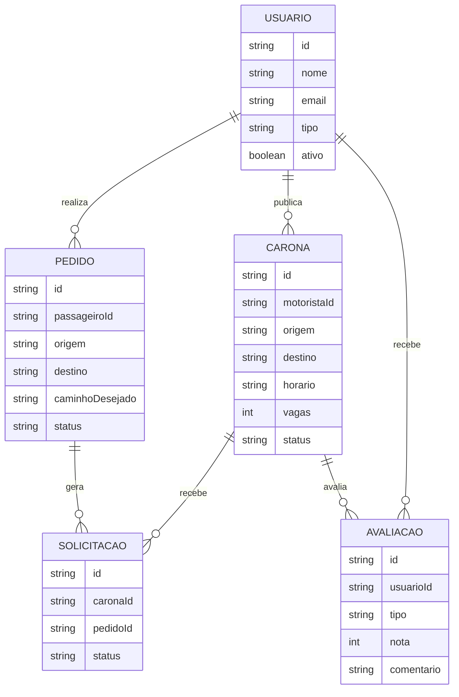

# Caronas UTFPR

Aplicação web para facilitar a organização de caronas entre estudantes da UTFPR, conectando motoristas e passageiros por origem, destino e caminho desejado. O objetivo é reduzir a fricção na busca por transporte, aumentar a confiança na combinação de rotas e tornar a organização de deslocamentos mais segura e simples.

## Autores

- Gabriel Campos — @GabrielCamposManzole

## Documentação Técnica

- [PRD](docs/prd.md) · [Architecture/SSD](docs/architecture.md) · [Checklist](docs/checklist.md)
- **Protótipo (Stitch/Figma):** em desenvolvimento / link público em breve

## Modelagem de Dados (Diagrama ER)



## Stack

- **Frontend:** Angular 20+
- **Framework CSS:** Tailwind CSS
- **Dados:** json-server (MVP/E2) → Supabase (E3)
- **Bibliotecas:** Angular Router, Angular Forms, RxJS, Mermaid

## Em produção

- **Aplicação:** em desenvolvimento

## Instruções de Execução

1. Clone o repositório:
   ```bash
   git clone https://github.com/GabrielCamposManzole/caronai.git
   cd caronai
   ```
2. Instale as dependências:
   ```bash
   npm install
   ```
3. Execute a aplicação localmente:
   ```bash
   npm start
   ```
4. Acesse a aplicação no navegador no endereço indicado pelo Angular CLI.

> Para a fase MVP, a aplicação pode consumir dados locais via json-server ou mock de dados, conforme a implementação do projeto.

## Telas da Aplicação

- Tela inicial com visão geral da plataforma
- Busca de caronas por origem e destino
- Publicação de oferta de carona
- Gerenciamento de solicitações e confirmações
- Histórico de viagens e avaliações


